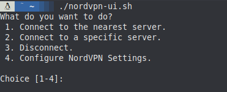
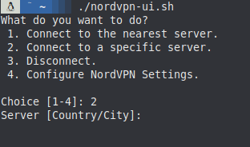
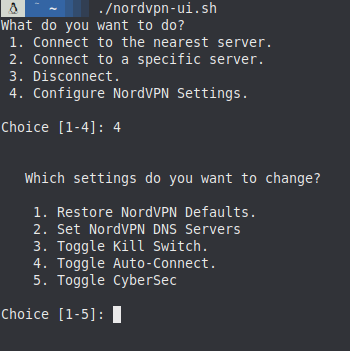

# nordvpn-text-ui

Since NordVPN on Linux doesn't have a UI, I decided to make a text-based one for simpler navigation.

This script is made in bash and isn't as efficient as it could be, but this is my first try scripting bash so I'd say I did pretty good.

It uses text-based navigation, where you type the number of the option that you want:

